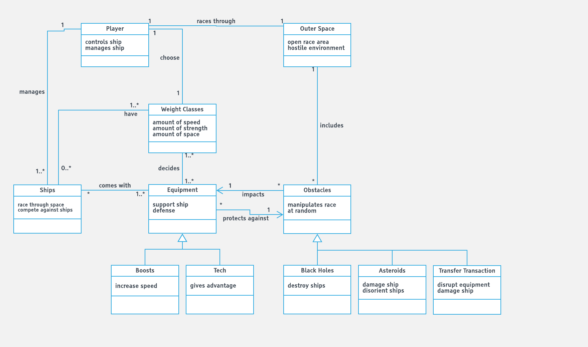
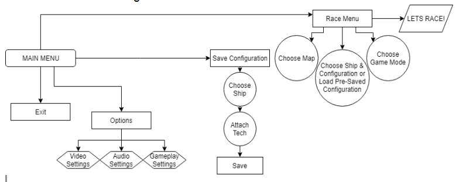
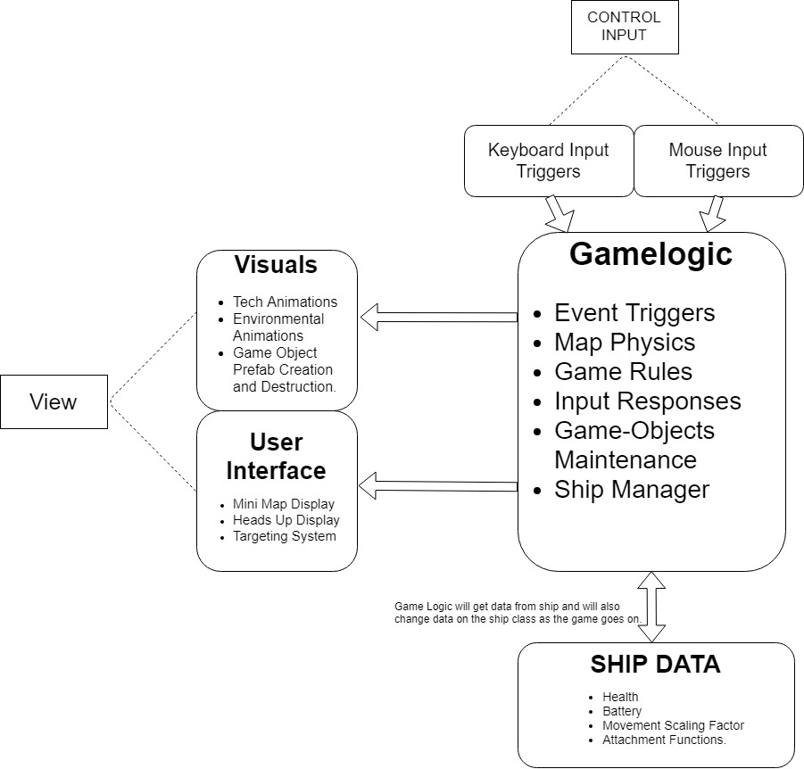

# PROJECT Design Documentation
> The following template provides the headings for your Design Documentation.  As you edit each section make sure you remove these commentary 'blockquotes'; the lines that start with a > character.

# Team Information
* Team name: B.S. Studios
* Team members
  * Israel Anthony
  * Sadanand Naik
  * Yun Jiang
  * JaJuan Webster
  * Weihao Yan

## Executive Summary

So far we have finalised on most design elements of the game. We plan to get most of the assets from the public domain. We have decided on a basic architecture on how to implement the code for the game.  

### Purpose
> Provide a very brief statement about the project and the most important user group and user goals.
Statement: The game aims to appease teenagers and young adults alike by giving an adrenaline pumping fast and furious action racing game.
                     
User group: 
            Teenagers and Young Adults;
            Hardcore racers;
            Fans who like to have interest in action and racing with strategizing their moves;
                       
User goal: Users can play the game that offers players the best of both racing as well as shooting action.

(Like.. what users want to get from our game?)

### Glossary and Acronyms
> Provide a table of terms and acronyms.

| Term | Definition |
|------|------------|
| Rapier	 | Small and light category spaceship |
| Eviscerator		| Medium category spaceship |
| Goliath | Heavy category space|

## Requirements
We would require the following to be able to create the game:
* A game engine.
* Art Assets.
* Sound Assets.
* Animations.8-12 months of development including play testing and debugging.

### Features

This section describes the main features of the game.

> In this section you do not need to be exhaustive and list every story.  Focus on top-level features and maybe Epics and *critical* Stories.

### Non-functional Requirements
> Key NFRs and technical constraints

* Creating game does pose a technical challenge for the developers.
* The project is also constrained to using Unity’s physics engine as the team lacks the knowledge to create one on their own.
* The game may need a lot more time than anticipated given the lack of technical experience on the team.

## Domain

This section describes the application domain.

> Replace the placeholder image above with your team's own domain model. 

> Provide a high-level overview of the domain. You can discuss the more important domain entities and their relationship to each other.

### Core Design:

* Space Blitz, at heart, is a racing game located in outer space and possibly on planets with versatile climates and topography. The key difference in this design is that there is no specific path for the player to run on. There is simply a starting point and an end point to the race. The rest is an interaction between each player and the environment/map and among multiple players themselves. 

* The interaction between environment and the players involves skillful, strategic moves by the player in order to cross the distance in the least amount of time while avoiding potentially catastrophic damage due to obstacles present in the environment.

* The interaction among the players is somewhat inspired by the gameplay of the game called Blur. The player can aim and shoot with the help of a targeting system that will be controlled by the mouse while they race. 

### Plot & Settings:

* The game is located in an outer space environment giving the players a taste of the potential hazards that may befall them in space travel. The theme of the game is fast and furious as well as futuristic. All the tech and ships will be from an era where space travel is common. The sound and music will also support this fast and furious theme coupled with cool futuristic animations. 

* We have  basic plot involving humanity dividing up into and arms race sometime in the 3000’s. Further depth is yet to be given to this narrative.

### Gameplay:

* After entering the game the player will get to the main menu after witnessing a creative splash screen. The player will have 4 options, namely, ‘RACE’, ‘Save Configuration’, ‘Options’ and ‘Exit’.

* The player can use the ‘Exit’ option to exit the game immediately. They may use the options menu to customize the gameplay mechanics, the sound or the graphics of the game.(It should be detailed that what gameplay mechanics.?)

* The Save Configuration option allows players to choose and maintain a specific combination of the ship of their choice and the tech they choose to attach on that ship which can be directly loaded onto the Race menu to move ahead into the game without having to choose and re-attach everything again and again. 

* The Race option brings the player to a menu where they may choose the location where they wish to race and also what type of ship they wish to use for that particular map as well as specify what tech to use on that ship. Additionally, they can also choose what type of game mode to play. From here they can press the “Start Race” Button to move ahead to the actual racing.

* Once the Race has started the players will use their tech and skills with those techs to gain an advantage over their opponents while trying to avoid being damaged from incoming fire from opponents as well as natural obstacles present in the environment like space rocks, gamma bolts etc. All tech uses battery power whose reserves depend on the size of the player’s ship. So the player must be mindful of not overusing the tech and make each application count.

* There are loading stations available for the player to go to and recharge their ship’s battery as well as health. They may also change the tech over at the loading stations at the cost of a small time penalty per tech change. The loading stations will be located a few ways away from the most direct routes to the end point so as to make the player be decisive if the they want to risk losing their ship and save some time or vice versa.

## Architecture

This section describes the application architecture.

### Summary
The following model shows a high-level view of the webapp's architecture.

> Replace the placeholder image above with your team's own architecture model. 

> Add a description of the architecture and key technical decisions

### Component 1 ...
> Provide a summary of each component with extra models as needed

### Component 1 ...
> Provide a summary of each component with extra models as needed

## Detailed Design

> You'll add to this section as needed as the project progresses

## Issues and Risks

> Open issues, risks, and your plan to address them (or plan to research options)
